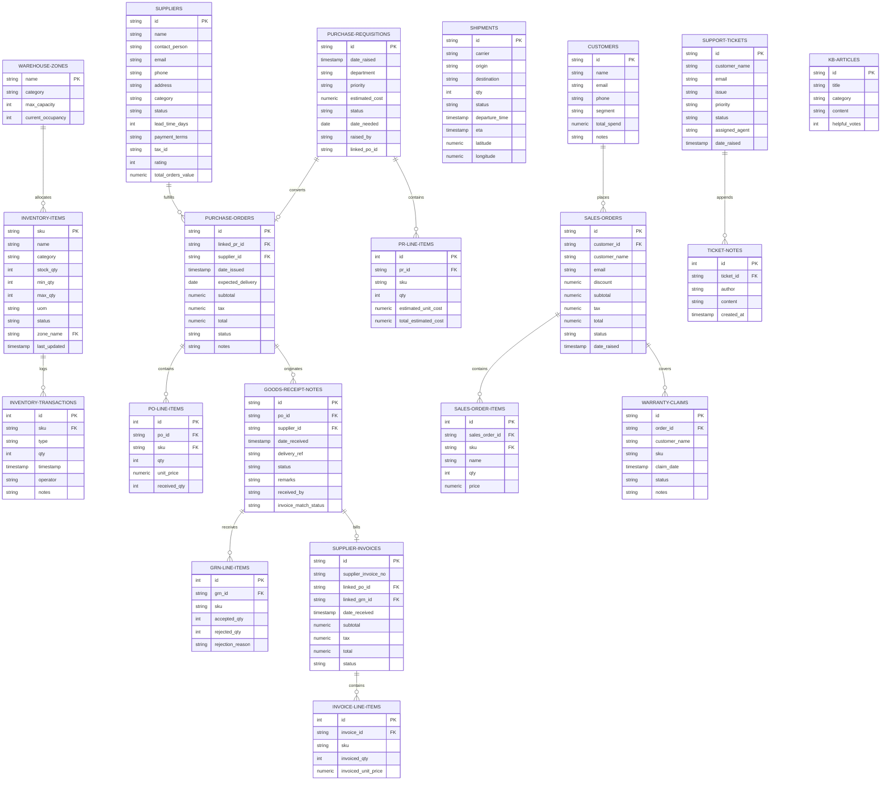

# Database Schema & Entity Relationship Diagram (ERD)

This document describes the database design for the **AMBATUGROW ERP System**. The relational model binds the five core operational modules: **Inventory & Warehouse Management**, **Procurement (Purchasing)**, **Supply Chain Management (SCM)**, **Sales Order Management**, and **Customer Service/Helpdesk**.

---

## 1. Entity Relationship Diagram (ERD)

The following Mermaid diagram represents the schema entities, primary keys (`PK`), foreign keys (`FK`), attributes, and relationship constraints.

---

## 2. Relational Schema Details

### 2.1 Inventory & Warehousing
* **`warehouse_zones`**: Identifies specific storage segments (e.g. `Warehouse A - Zone 1`). Constrains total capacities to prevent physical overfill.
* **`inventory_items`**: Holds standard catalog SKU items. Integrates with Vercel's real-time occupancy gauges. A foreign key links each product to its storage zone.
* **`inventory_transactions`**: Logs all movements (`IN` arrivals or `OUT` sales dispatches) as a ledger history.

### 2.2 Requisition & Procurement
* **`suppliers`**: Stores catalog listings, ratings, and cumulative order metrics.
* **`purchase_requisitions`**: Standardizes purchase requests. Connects through workflow pipelines for L1 (Officer) and L2 (Manager) authorization levels.
* **`purchase_orders`**: Formal PO records. Stores cumulative values and links to matching goods receipts.
* **`goods_receipt_notes`**: Logs arrivals. acceptance quantity metrics automatically increment matching product stock inside the `inventory_items` table.
* **`supplier_invoices`**: Audits accounts payable against PO contract prices and GRN accepted quantities (3-way match validation).

### 2.3 Logistics & SCM
* **`shipments`**: Tracks active coordinate telemetry (`latitude`, `longitude`). background animation loops update position intervals towards targets in Cavite.

### 2.4 Sales Order Lifecycle
* **`customers`**: VIP and regular segments compiled from transaction histories.
* **`sales_orders`**: Houses invoices. Successful checkout automatically deducts quantities from `inventory_items`.
* **`warranty_claims`**: Files service complaints. Validates against order databases to prevent fraud.

### 2.5 Support Helpdesk
* **`support_tickets`**: Tracks response SLAs. Escalates issues based on severity triggers.
* **`ticket_notes`**: Internal team case discussion threads.
* **`kb_articles`**: Self-service solution manuals.

---

## 3. Dynamic Triggers (ERP Connections)

The system enforces three direct database connection rules:
1. **Sales Checkout Stock Deduction**: Creating a `sales_order` decrements `inventory_items.stock_qty`. If it falls below `min_qty`, a critical low-stock alert is generated.
2. **Goods Receipt Stock Increment**: Creating a `goods_receipt_note` (GRN) automatically increments matching `inventory_items.stock_qty` values.
3. **Inter-Warehouse Transfer Execution**: Registering a stock transfer in SCM calls `transferItems` to reduce counts in the origin zone and increase them in the target zone.
