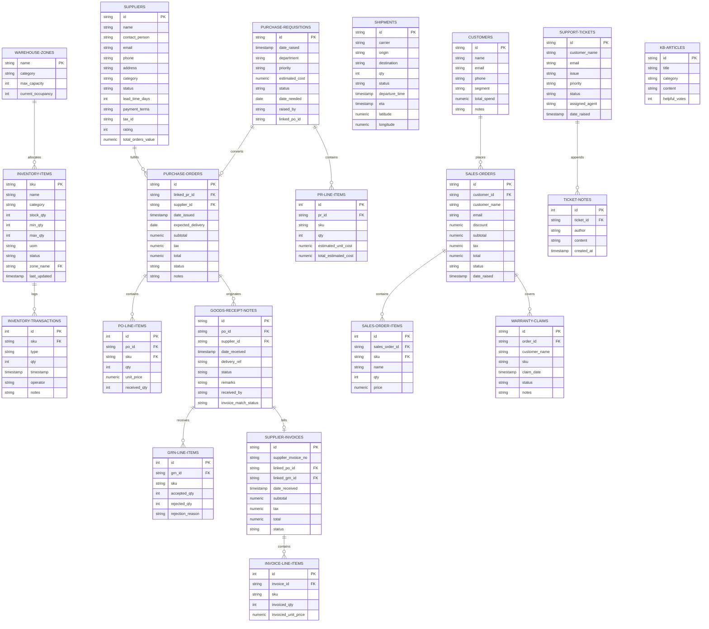

# AMBATUGROW ERP Ecosystem Terminal

An enterprise-grade, Vercel-ready ERP system designed to coordinate core operational modules: **Inventory & Warehouse Tracking**, **Procurement (Purchasing)**, **Supply Chain Management (SCM)**, **Sales Order Management**, and **Customer Service/Helpdesk**.

---

## 🗄️ Database Architecture & ERD

The system is designed with PostgreSQL-compliant relational rules that dynamically sync actions across contexts (e.g. Sales checkouts deduct stock, Procurement GRNs increment stock).

### Entity Relationship Diagram (ERD)

Below is the active schema model. Vercel/GitHub renders this diagram natively using Mermaid:



* **SQL Script Source**: [`schema.sql`](./schema.sql)
* **Detailed Schema Descriptions**: [`DATABASE.md`](./DATABASE.md)

### 🗄️ SQL Database Schema (PostgreSQL)

Below is the raw DDL schema script used to construct the database. Click to expand and view the full setup:

<details>
<summary><b>View schema.sql</b></summary>

```sql
-- =============================================================================
-- AMBATUGROW ERP SYSTEM DATABASE SCHEMA (PostgreSQL)
-- Version: 1.0.0
-- Modules: Inventory, Procurement, Supply Chain, Sales, and Helpdesk
-- =============================================================================

-- Enable UUID extension for unique identifiers if required
CREATE EXTENSION IF NOT EXISTS "uuid-ossp";

-- =============================================================================
-- 1. INVENTORY & WAREHOUSE MANAGEMENT MODULE
-- =============================================================================

CREATE TABLE warehouse_zones (
    name VARCHAR(50) PRIMARY KEY,
    category VARCHAR(50) NOT NULL,
    max_capacity INTEGER NOT NULL CHECK (max_capacity > 0),
    current_occupancy INTEGER NOT NULL DEFAULT 0 CHECK (current_occupancy >= 0),
    created_at TIMESTAMP WITH TIME ZONE DEFAULT CURRENT_TIMESTAMP,
    updated_at TIMESTAMP WITH TIME ZONE DEFAULT CURRENT_TIMESTAMP
);

CREATE TABLE inventory_items (
    sku VARCHAR(50) PRIMARY KEY,
    name VARCHAR(100) NOT NULL,
    category VARCHAR(50) NOT NULL,
    stock_qty INTEGER NOT NULL DEFAULT 0 CHECK (stock_qty >= 0),
    min_qty INTEGER NOT NULL DEFAULT 0 CHECK (min_qty >= 0),
    max_qty INTEGER NOT NULL DEFAULT 0 CHECK (max_qty >= 0),
    uom VARCHAR(10) NOT NULL,
    status VARCHAR(20) NOT NULL DEFAULT 'Active' CHECK (status IN ('Active', 'Inactive', 'Discontinued')),
    zone_name VARCHAR(50) NOT NULL REFERENCES warehouse_zones(name) ON UPDATE CASCADE,
    last_updated TIMESTAMP WITH TIME ZONE DEFAULT CURRENT_TIMESTAMP
);

CREATE TABLE inventory_transactions (
    id SERIAL PRIMARY KEY,
    sku VARCHAR(50) NOT NULL REFERENCES inventory_items(sku) ON DELETE CASCADE,
    type VARCHAR(3) NOT NULL CHECK (type IN ('IN', 'OUT')),
    qty INTEGER NOT NULL CHECK (qty > 0),
    timestamp TIMESTAMP WITH TIME ZONE DEFAULT CURRENT_TIMESTAMP,
    operator VARCHAR(50) NOT NULL,
    notes TEXT
);

-- =============================================================================
-- 2. PROCUREMENT & PURCHASING MODULE
-- =============================================================================

CREATE TABLE suppliers (
    id VARCHAR(50) PRIMARY KEY,
    name VARCHAR(100) NOT NULL,
    contact_person VARCHAR(100) NOT NULL,
    email VARCHAR(100) NOT NULL UNIQUE,
    phone VARCHAR(30) NOT NULL,
    address TEXT NOT NULL,
    category VARCHAR(50) NOT NULL,
    status VARCHAR(20) NOT NULL DEFAULT 'Active' CHECK (status IN ('Active', 'Inactive', 'Blacklisted')),
    lead_time_days INTEGER NOT NULL CHECK (lead_time_days >= 0),
    payment_terms VARCHAR(30) NOT NULL DEFAULT 'Net 30',
    tax_id VARCHAR(30) NOT NULL,
    rating INTEGER DEFAULT 5 CHECK (rating BETWEEN 1 AND 5),
    total_orders_value NUMERIC(15, 2) NOT NULL DEFAULT 0.00
);

CREATE TABLE purchase_requisitions (
    id VARCHAR(50) PRIMARY KEY,
    date_raised TIMESTAMP WITH TIME ZONE DEFAULT CURRENT_TIMESTAMP,
    department VARCHAR(50) NOT NULL,
    priority VARCHAR(10) NOT NULL DEFAULT 'Normal' CHECK (priority IN ('Low', 'Normal', 'Urgent')),
    estimated_cost NUMERIC(15, 2) NOT NULL DEFAULT 0.00 CHECK (estimated_cost >= 0),
    status VARCHAR(30) NOT NULL DEFAULT 'Pending L1 Approval' CHECK (status IN ('Pending L1 Approval', 'Pending L2 Approval', 'Approved', 'Rejected', 'Converted to PO')),
    date_needed DATE NOT NULL,
    raised_by VARCHAR(50) NOT NULL,
    linked_po_id VARCHAR(50)
);

CREATE TABLE pr_line_items (
    id SERIAL PRIMARY KEY,
    pr_id VARCHAR(50) NOT NULL REFERENCES purchase_requisitions(id) ON DELETE CASCADE,
    sku VARCHAR(50) NOT NULL,
    qty INTEGER NOT NULL CHECK (qty > 0),
    estimated_unit_cost NUMERIC(15, 2) NOT NULL CHECK (estimated_unit_cost >= 0),
    total_estimated_cost NUMERIC(15, 2) GENERATED ALWAYS AS (qty * estimated_unit_cost) STORED
);

CREATE TABLE purchase_orders (
    id VARCHAR(50) PRIMARY KEY,
    linked_pr_id VARCHAR(50) REFERENCES purchase_requisitions(id) ON DELETE SET NULL,
    supplier_id VARCHAR(50) NOT NULL REFERENCES suppliers(id) ON UPDATE CASCADE,
    date_issued TIMESTAMP WITH TIME ZONE DEFAULT CURRENT_TIMESTAMP,
    expected_delivery DATE NOT NULL,
    subtotal NUMERIC(15, 2) NOT NULL DEFAULT 0.00,
    tax NUMERIC(15, 2) NOT NULL DEFAULT 0.00,
    total NUMERIC(15, 2) NOT NULL DEFAULT 0.00,
    status VARCHAR(30) NOT NULL DEFAULT 'Draft' CHECK (status IN ('Draft', 'Approved', 'Sent to Supplier', 'Partially Received', 'Fully Received', 'Cancelled')),
    notes TEXT
);

CREATE TABLE po_line_items (
    id SERIAL PRIMARY KEY,
    po_id VARCHAR(50) NOT NULL REFERENCES purchase_orders(id) ON DELETE CASCADE,
    sku VARCHAR(50) NOT NULL REFERENCES inventory_items(sku) ON UPDATE CASCADE,
    qty INTEGER NOT NULL CHECK (qty > 0),
    unit_price NUMERIC(15, 2) NOT NULL CHECK (unit_price >= 0),
    received_qty INTEGER NOT NULL DEFAULT 0 CHECK (received_qty >= 0)
);

CREATE TABLE goods_receipt_notes (
    id VARCHAR(50) PRIMARY KEY,
    po_id VARCHAR(50) NOT NULL REFERENCES purchase_orders(id) ON DELETE CASCADE,
    supplier_id VARCHAR(50) NOT NULL REFERENCES suppliers(id),
    date_received TIMESTAMP WITH TIME ZONE DEFAULT CURRENT_TIMESTAMP,
    delivery_ref VARCHAR(50) NOT NULL,
    status VARCHAR(20) NOT NULL CHECK (status IN ('Complete', 'Partial', 'Discrepancy')),
    remarks TEXT,
    received_by VARCHAR(50) NOT NULL,
    invoice_match_status VARCHAR(20) NOT NULL DEFAULT 'Pending' CHECK (invoice_match_status IN ('Pending', 'Matched', 'Partial Match', 'Discrepancy'))
);

CREATE TABLE grn_line_items (
    id SERIAL PRIMARY KEY,
    grn_id VARCHAR(50) NOT NULL REFERENCES goods_receipt_notes(id) ON DELETE CASCADE,
    sku VARCHAR(50) NOT NULL,
    accepted_qty INTEGER NOT NULL CHECK (accepted_qty >= 0),
    rejected_qty INTEGER NOT NULL DEFAULT 0 CHECK (rejected_qty >= 0),
    rejection_reason VARCHAR(50)
);

CREATE TABLE supplier_invoices (
    id VARCHAR(50) PRIMARY KEY,
    supplier_invoice_no VARCHAR(50) NOT NULL,
    linked_po_id VARCHAR(50) NOT NULL REFERENCES purchase_orders(id),
    linked_grn_id VARCHAR(50) NOT NULL REFERENCES goods_receipt_notes(id),
    date_received TIMESTAMP WITH TIME ZONE DEFAULT CURRENT_TIMESTAMP,
    subtotal NUMERIC(15, 2) NOT NULL DEFAULT 0.00,
    tax NUMERIC(15, 2) NOT NULL DEFAULT 0.00,
    total NUMERIC(15, 2) NOT NULL DEFAULT 0.00,
    status VARCHAR(30) NOT NULL DEFAULT 'Pending' CHECK (status IN ('Pending', 'Matched', 'Partial Match', 'Discrepancy', 'Approved for Payment', 'Disputed'))
);

CREATE TABLE invoice_line_items (
    id SERIAL PRIMARY KEY,
    invoice_id VARCHAR(50) NOT NULL REFERENCES supplier_invoices(id) ON DELETE CASCADE,
    sku VARCHAR(50) NOT NULL,
    invoiced_qty INTEGER NOT NULL CHECK (invoiced_qty > 0),
    invoiced_unit_price NUMERIC(15, 2) NOT NULL CHECK (invoiced_unit_price >= 0)
);

-- =============================================================================
-- 3. SUPPLY CHAIN MANAGEMENT (SCM) MODULE
-- =============================================================================

CREATE TABLE shipments (
    id VARCHAR(50) PRIMARY KEY,
    carrier VARCHAR(100) NOT NULL,
    origin VARCHAR(100) NOT NULL,
    destination VARCHAR(100) NOT NULL,
    qty INTEGER NOT NULL CHECK (qty > 0),
    status VARCHAR(20) NOT NULL DEFAULT 'Processing' CHECK (status IN ('Processing', 'In Transit', 'Delivered')),
    departure_time TIMESTAMP WITH TIME ZONE,
    eta TIMESTAMP WITH TIME ZONE,
    latitude NUMERIC(9, 6),
    longitude NUMERIC(9, 6)
);

-- =============================================================================
-- 4. SALES ORDER & CUSTOMER RELATIONSHIP MANAGEMENT
-- =============================================================================

CREATE TABLE customers (
    id VARCHAR(50) PRIMARY KEY,
    name VARCHAR(100) NOT NULL,
    email VARCHAR(100) NOT NULL UNIQUE,
    phone VARCHAR(30) NOT NULL,
    segment VARCHAR(20) NOT NULL DEFAULT 'Lead' CHECK (segment IN ('Lead', 'Regular', 'VIP')),
    total_spend NUMERIC(15, 2) NOT NULL DEFAULT 0.00,
    notes TEXT
);

CREATE TABLE sales_orders (
    id VARCHAR(50) PRIMARY KEY,
    customer_id VARCHAR(50) REFERENCES customers(id) ON DELETE SET NULL,
    customer_name VARCHAR(100) NOT NULL,
    email VARCHAR(100) NOT NULL,
    discount NUMERIC(15, 2) NOT NULL DEFAULT 0.00 CHECK (discount >= 0),
    subtotal NUMERIC(15, 2) NOT NULL DEFAULT 0.00,
    tax NUMERIC(15, 2) NOT NULL DEFAULT 0.00,
    total NUMERIC(15, 2) NOT NULL DEFAULT 0.00,
    status VARCHAR(20) NOT NULL DEFAULT 'Processed' CHECK (status IN ('Pending L1', 'Processed', 'Shipped', 'Fulfilled')),
    date_raised TIMESTAMP WITH TIME ZONE DEFAULT CURRENT_TIMESTAMP
);

CREATE TABLE sales_order_items (
    id SERIAL PRIMARY KEY,
    sales_order_id VARCHAR(50) NOT NULL REFERENCES sales_orders(id) ON DELETE CASCADE,
    sku VARCHAR(50) NOT NULL REFERENCES inventory_items(sku) ON UPDATE CASCADE,
    name VARCHAR(100) NOT NULL,
    qty INTEGER NOT NULL CHECK (qty > 0),
    price NUMERIC(15, 2) NOT NULL CHECK (price >= 0)
);

CREATE TABLE warranty_claims (
    id VARCHAR(50) PRIMARY KEY,
    order_id VARCHAR(50) NOT NULL REFERENCES sales_orders(id),
    customer_name VARCHAR(100) NOT NULL,
    sku VARCHAR(50) NOT NULL,
    claim_date TIMESTAMP WITH TIME ZONE DEFAULT CURRENT_TIMESTAMP,
    status VARCHAR(20) NOT NULL DEFAULT 'Received' CHECK (status IN ('Received', 'Approved', 'Rejected')),
    notes TEXT
);

-- =============================================================================
-- 5. HELPDESK & CUSTOMER SUPPORT MODULE
-- =============================================================================

CREATE TABLE support_tickets (
    id VARCHAR(50) PRIMARY KEY,
    customer_name VARCHAR(100) NOT NULL,
    email VARCHAR(100) NOT NULL,
    issue TEXT NOT NULL,
    priority VARCHAR(10) NOT NULL DEFAULT 'Medium' CHECK (priority IN ('Low', 'Medium', 'High')),
    status VARCHAR(20) NOT NULL DEFAULT 'Open' CHECK (status IN ('Open', 'Resolved')),
    assigned_agent VARCHAR(50) NOT NULL,
    date_raised TIMESTAMP WITH TIME ZONE DEFAULT CURRENT_TIMESTAMP
);

CREATE TABLE ticket_notes (
    id SERIAL PRIMARY KEY,
    ticket_id VARCHAR(50) NOT NULL REFERENCES support_tickets(id) ON DELETE CASCADE,
    author VARCHAR(50) NOT NULL,
    content TEXT NOT NULL,
    created_at TIMESTAMP WITH TIME ZONE DEFAULT CURRENT_TIMESTAMP
);

CREATE TABLE kb_articles (
    id VARCHAR(50) PRIMARY KEY,
    title VARCHAR(150) NOT NULL,
    category VARCHAR(50) NOT NULL,
    content TEXT NOT NULL,
    helpful_votes INTEGER NOT NULL DEFAULT 0
);

-- =============================================================================
-- INDEXES FOR PERFORMANCE OPTIMIZATION
-- =============================================================================

-- Inventory
CREATE INDEX idx_inventory_zone ON inventory_items(zone_name);
CREATE INDEX idx_inventory_status ON inventory_items(status);
CREATE INDEX idx_transactions_sku ON inventory_transactions(sku);

-- Procurement
CREATE INDEX idx_pr_status ON purchase_requisitions(status);
CREATE INDEX idx_po_supplier ON purchase_orders(supplier_id);
CREATE INDEX idx_po_status ON purchase_orders(status);
CREATE INDEX idx_grn_po ON goods_receipt_notes(po_id);
CREATE INDEX idx_invoice_po ON supplier_invoices(linked_po_id);

-- Sales & SCM
CREATE INDEX idx_shipment_status ON shipments(status);
CREATE INDEX idx_sales_customer ON sales_orders(customer_id);
CREATE INDEX idx_sales_status ON sales_orders(status);
CREATE INDEX idx_claims_order ON warranty_claims(order_id);

-- Helpdesk
CREATE INDEX idx_ticket_status ON support_tickets(status);
CREATE INDEX idx_ticket_priority ON support_tickets(priority);
CREATE INDEX idx_notes_ticket ON ticket_notes(ticket_id);
```
</details>

---

## 🚀 Getting Started

### Prerequisites

* Node.js 18+ or Vercel CLI
* Git

### Local Setup

1. Clone and enter the repository directory:
   ```bash
   git clone https://github.com/CardboardB0X/AmbatuGrow.git
   cd AmbatuGrow
   ```

2. Install project dependencies:
   ```bash
   npm install
   ```

3. Run the development server:
   ```bash
   npm run dev
   ```

4. Open [http://localhost:3000](http://localhost:3000) in your web browser.
